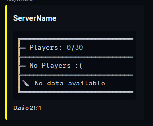

# PlayerListDiscord Plugin

A plugin for SCP: Secret Laboratory that integrates the player list with Discord.

## Features

- Displays the current player list on a specified Discord channel.  
- Automatic updates at a configurable interval.  
- Supports Discord messages (creating a new one or updating an existing one).  
- Easy configuration management.  

## Requirements

- SCP: Secret Laboratory server with the Exiled API.  
- Discord bot with the necessary permissions (sending messages, embedding content).  
- Discord bot token.  

## Installation

1. Download the latest version of the plugin from the [Releases](https://github.com/Cat-Potato/PlayerListDiscord/releases).  
2. Copy the DLL file to the `Plugins` folder on your server.
3. Download `dependencies.zip` and extract it.
4. Place it in the `dependencies` folder.

## Incompatible
- [DiscordIntegration](https://github.com/Exiled-Team/DiscordIntegration)

## Testers
- [Altzheimer Von Cruvez](https://steamcommunity.com/profiles/76561199515830986/)

## Configuration  

Configuration file:

## Showcase

