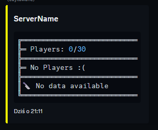

# PlayerListDiscord Plugin  

Plugin do SCP: Secret Laboratory, który integruje listę graczy z Discordem.

## Funkcje  

- Wyświetlanie aktualnej listy graczy na określonym kanale Discord.  
- Automatyczna aktualizacja co skonfigurowany czas.  
- Obsługa wiadomości Discord (tworzenie nowej lub aktualizacja istniejącej).  
- Łatwe zarządzanie konfiguracją.  

## Wymagania  

- Serwer SCP: Secret Laboratory z Exiled API.  
- Bot Discord z odpowiednimi uprawnieniami (wysyłanie wiadomości, osadzanie treści).  
- Token bota Discord.   

## Instalacja  

1. Pobierz najnowszą wersję wtyczki z [Releases](https://github.com/Cat-Potato/PlayerListDiscord/releases).  
2. Skopiuj plik DLL do folderu `Plugins` na swoim serwerze.
3. Pobierz `dependencies.zip` i rozpakuj.
4. Wrzuć do folderu `dependencies`.

## Niekompatybilny
- [DiscordIntegration](https://github.com/Exiled-Team/DiscordIntegration)

## Testerzy
- [Altzheimer Von Cruvez](https://steamcommunity.com/profiles/76561199515830986/)

## Konfiguracja  

Plik konfiguracyjny:  

<iframe
  src="https://carbon.now.sh/embed?bg=rgba%28171%2C+184%2C+195%2C+1%29&t=seti&wt=boxy&l=auto&width=779&ds=false&dsyoff=20px&dsblur=68px&wc=true&wa=false&pv=0px&ph=0px&ln=false&fl=1&fm=Hack&fs=14px&lh=133%25&si=false&es=2x&wm=false&code=playerlist%253A%250A%2520%2520is_enabled%253A%2520true%250A%2520%2520debug%253A%2520false%250A%2520%2520%2523%2520Auto%2520Update%2520info%2520Plugin%253A%250A%2520%2520update_info%253A%2520true%250A%2520%2520%2523%2520Bot%253A%250A%2520%2520bot_token%253A%2520%27Discord_Bot_Token%27%250A%2520%2520channel_id%253A%2520123456789012345678%250A%2520%2520discord_message_id%253A%25200%250A%2520%2520name_server%253A%2520%27ServerName%27%250A%2520%2520player_label%253A%2520%27Players%253A%27%250A%2520%2520%2523%2520Only%2520HEX%2520color%250A%2520%2520embed_color%253A%2520%27%2523FFFF00%27%250A%2520%2520no_player%253A%2520%27No%2520Players%2520%253A%28%27%250A%2520%2520max_players%253A%252030%250A%2520%2520%2523%2520Player%2520list%2520refresh%2520interval%2520%28in%2520ms%29%250A%2520%2520refresh_interval%253A%252010000%250A%2520%2520ascii_art%253A%2520true"
  style="width: 779px; height: 491px; border:0; transform: scale(1); overflow:hidden;"
  sandbox="allow-scripts allow-same-origin">
</iframe>

## Showcase

S
