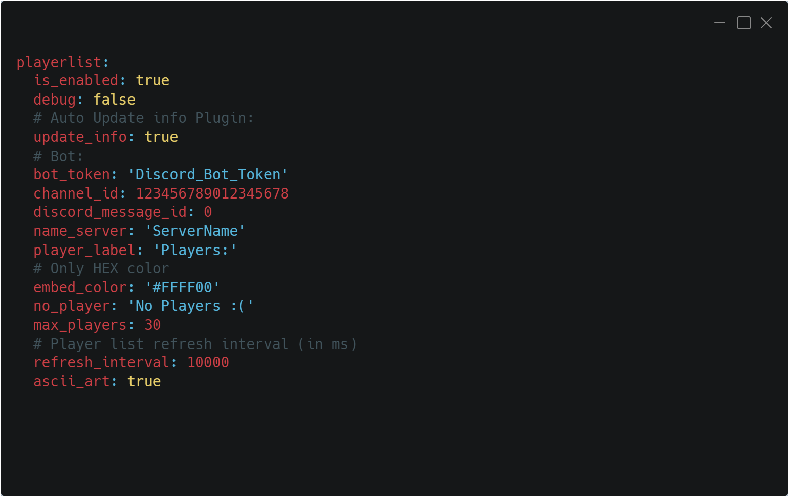

# PlayerListDiscord Plugin  

Plugin do SCP: Secret Laboratory, który integruje listę graczy z Discordem.

## Funkcje  

- Wyświetlanie aktualnej listy graczy na określonym kanale Discord.  
- Automatyczna aktualizacja co skonfigurowany czas.  
- Obsługa wiadomości Discord (tworzenie nowej lub aktualizacja istniejącej).  
- Łatwe zarządzanie konfiguracją.  

## Wymagania  

- Serwer SCP: Secret Laboratory z Exiled API.  
- Bot Discord z odpowiednimi uprawnieniami (wysyłanie wiadomości, osadzanie treści).  
- Token bota Discord.   

## Instalacja  

1. Pobierz najnowszą wersję wtyczki z [Releases](https://github.com/Cat-Potato/PlayerListDiscord/releases).  
2. Skopiuj plik DLL do folderu `Plugins` na swoim serwerze.
3. Pobierz `dependencies.zip` i rozpakuj.
4. Wrzuć do folderu `dependencies`.

## Niekompatybilny
- [DiscordIntegration](https://github.com/Exiled-Team/DiscordIntegration)

## Testerzy
- [Altzheimer Von Cruvez](https://steamcommunity.com/profiles/76561199515830986/)

## Konfiguracja  

Plik konfiguracyjny:  

## Showcase

S
